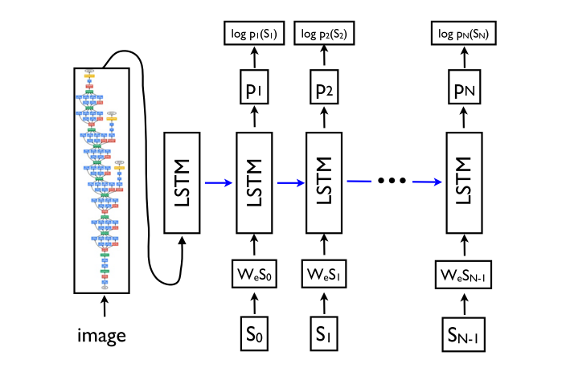
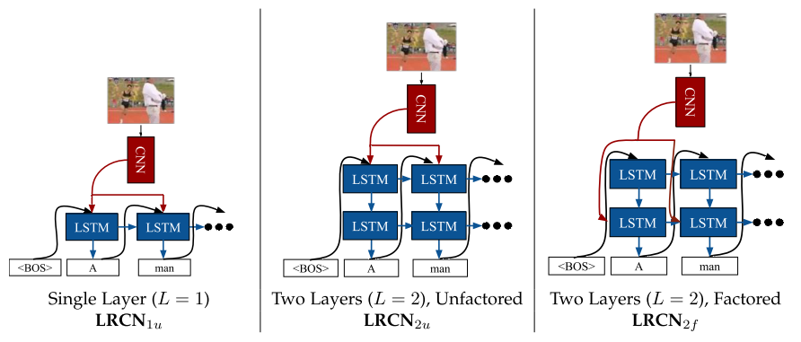
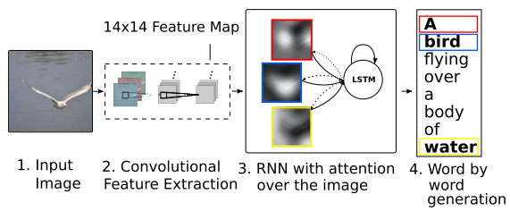
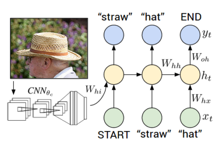
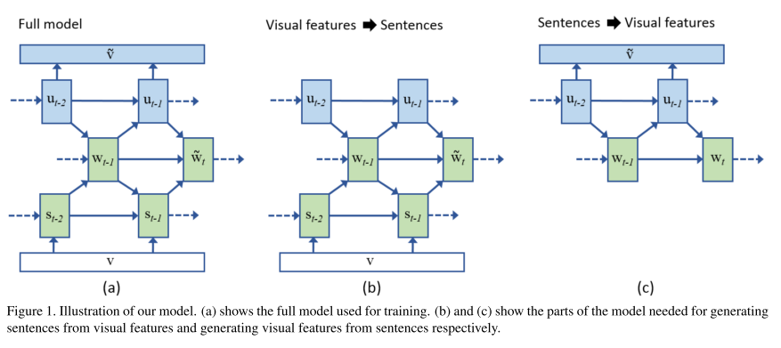
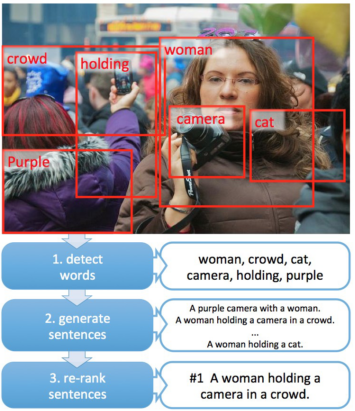
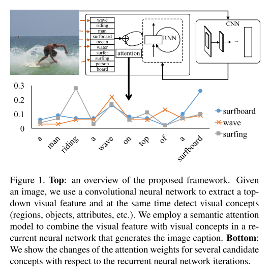
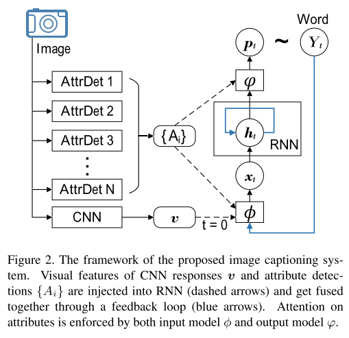
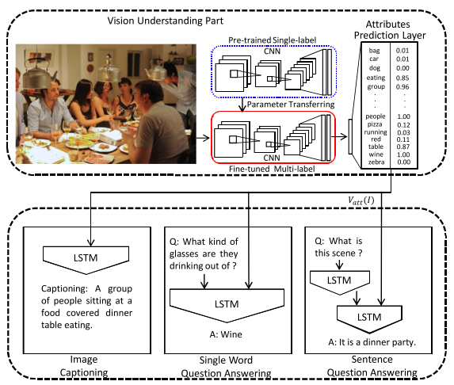
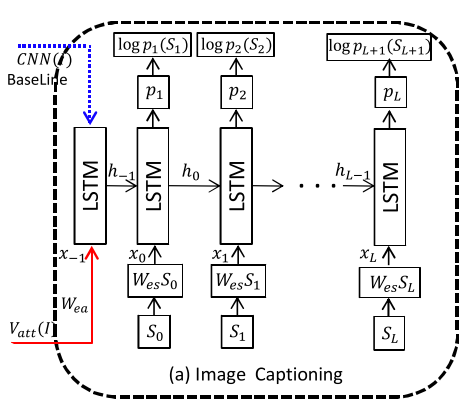

Literature Survey
===================

Show and Tell: A Neural Image Caption Generator 
--------------------------------------------------
It is a simple end-to-end model :cite:`vinyals2015show` which is built on top of a Convolutional Neural Network (CNN) and a special type of Recurrent Neural Network called as Long Short Term Memory Network (LSTM) . At initial time step visual are used in LSTMs as input. After first time step, vector representations of sentence words becomes input parameters of recurrent network. Word embeddings are also learned during training. Sampling and BeamSearch methods are used for inference. The proposed framework is tested on five different public datasets and it was the state-of-art by then. Generation and ranking results are reported using several evaluation metrics. There's also `TensorFlow implementation <https://github.com/jazzsaxmafia/show_attend_and_tell.tensorflow>`_.

   Model Overview

Long-term Recurrent Convolutional Networks for Visual Recognition and Description
-------------------------------------------------------------------------------------
This paper :cite:`donahue2015long` presents solutions for image captioning (as well as video captioning and activity recognition). Its framework is also a combination of a CNN and LSTMs. Unlike :cite:`vinyals2015show`, visual features are used in each time step. Also, it proposes *factorization* property for LSTM networks and makes experiments with three different models. It uses a different inference strategy (I didn't figured out it clearly yet) together with BeamSearch. The results are competitive. What's more, it has `Caffe implementation <https://github.com/BVLC/caffe/pull/2033/commits/668b17ede1e31a1d4a2663bd81357ab92065f812>`_.

   Model Overview

Show, attend and tell: Neural image caption generation with visual attention
-----------------------------------------------------------------------------
This paper :cite:`xu2015show` is the first neural caption generation with visual `attention <www.wildml.com/2016/01/attention-and-memory-in-deep-learning-and-nlp/>`_. It uses two different attention mechanisms. Its model also very similar to :cite:`vinyals2015show` and extends it with attention. There are two implementations on GitHub with `Theano <https://github.com/kelvinxu/arctic-captions>`_ and `TensorFlow <https://github.com/jazzsaxmafia/show_attend_and_tell.tensorflow>`_. The model outperformed previous state-of-art work.

**Note**: I understand the intention behind attention mechanism. However, I really get lost when I try to understand mathematical foundations. I guess I will get the full idea when I attemp to implement model.

   Model Overview

Deep Visual-Semantic Alignments for Generating Image Descriptions
----------------------------------------------------------------------
This paper :cite:`karpathy2015deep` presents a novel framework which consists of two parts: visual-language data alignment and multimodal RNN (m-RNN) for generating descriptions. In the alignment objective, image features are generated with Region Convolutional Neural Network (RCNN) and caption sentences are represented with bidirectional RNN (BRNN) built on LSTMs. In the proposed generative m-RNN framework, input can be full image and their sentence descriptions as well as image region and region description pairs generated by the alignment framework. Also, it has a `Torch implementation <https://github.com/karpathy/neuraltalk2/>`_  (without alignment part) on Github. The proposed model couldn't surpass Google NIC :cite:`vinyals2015show` according to the evaluation metrics used in both papers. Finally, the authors extended this work in the follow up paper :cite:`johnson2015densecap` (this one does not include some common evaluation metrics like BLEU). Karpathy also shared extracted VGG features on the `project website <http://cs.stanford.edu/people/karpathy/deepimagesent/>`_.

   Model Overview (Only generation, without alignment)

Learning a recurrent visual representation for image caption generation
-------------------------------------------------------------------------
This paper :cite:`chen2014learning` introduces a novel model which aims not only generating captions from images but also building visual features from previous words at the same time. Actually, the proposed model is more complicated than the papers which I've summarized above (and I haven't understand it completely). They used a pretrained CNN for obtaining visual features same as the papers above. Words are represented as *one hot vectors* whose size is equal to the size of vocabulary. It has been implied in the paper, caption generation results were state-of-art by then.

In the figure, :math:`w_t`, :math:`s_t`, :math:`u_t` are word, hidden state and latent variable at time :math:`t` respectively.

From captions to visual concepts and back
-------------------------------------------
The actual paper I've selected as my project :cite:`you2016image` mentions this paper :cite:`fang2015captions` and implies that it follows a different approach (*bottom-up*) unlike the others I've read until now and this is why I've read this paper even though this particular model does not include a recurrent network. As reported in `COCO Leaderboard <http://mscoco.org/dataset/#captions-leaderboard>`_, it showed state-of-art results according to some evaluation metrics which humans involve. First, the model tries to find word correspondences for image regions by extracting features with a CNN and then combining those features with multiple instance learning. Later then, a statistical language model (maximum entropy) generates candidate sentences with usage of beam search. After generation, the sentences are re-ranked using minimum error rate training. Re-ranking is done by a deep multimodal similarity model which extends deep structured semantic model (I didn't investigate it).

   Model illustration.

Image Captioning with Semantic Attention
-------------------------------------------
This :cite:`you2016image` is my actual project paper. Its model also consists of a combination of a CNN and a RNN with a different attention mechanism developed in :cite:`xu2015show`. It says that not only its attention mechanism is spatially free unlike the other but also it takes advantage of combining bottom-up features with visual features as a feedback system. The model offers two attention mechanism for input and output. The framework is much more complicated than the papers above. Learning is done by minimizing a particular loss function (the aggregate negative log-likelihood of all the words combined with regularization terms on attention scores, see section 3.4). Visual attributes are generated by various approaches including nearest neighbours :cite:`devlin2015exploring` and fully convolutional networks :cite:`long2015fully`. It outperformed state-of-art results at the time. There are no public implementation of this model.

What value high level concepts in vision to language problems?
----------------------------------------------------------------
This one :cite:`wu2015value` seeks a common solution for both image captioning and visual question answering task. They claimed that the proposed model surpassed previous state-of-art methods (including my actual paper) for both tasks (also better than human evaluation according to some metrics). In the beginning, they build an attribute vocabulary which contains image-word probabilities (part of speech merged). The language model is built on top of LSTM network which uses attributes vector and CNN features as initial inputs and sentence words as sequential inputs. Note that, this paper's first version was published in 2015, and then they've updated it 5 times. I have just read its first version quickly and their model was similar but they couldn't outperform the state-of-art by then.

   Framework Overview

   Language Model

.. bibliography:: survey.bib
